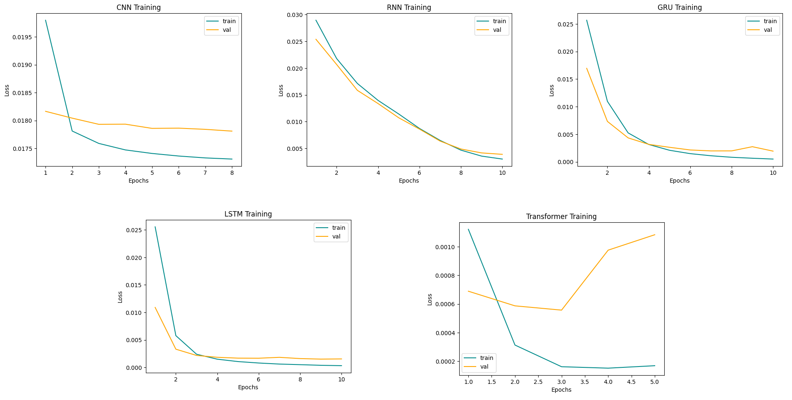

# Text Style Classification between _Dante, Italian and Neapolitan_ language: a comparison between CNN, RNNs and Transformer based Classifiers 📖 🤔
A Pytorch implementation of Text Style Classification. 

The goal of this project is to compare different architecture accuracy in predicting 3 italic language styles: _Dante, Italian and Neapolitan_. 

The Classifiers taken in consideration are CNN, RNNs, and Transformer based:
* **CNN Classifier**: made up of three 2D Convolutional layers with a 3x3 kernel
* **RNN Classifier**: takes the last hidden state of a Recursive Neural Network and classifies sentences from it
* **GRU Classifier**: takes the last hidden state of a Recursive Neural Network with GRU cell and classifies sentences from it
* **LSTM Classifier**: takes the last hidden state of a Recursive Neural Network with LSTM cell and classifies sentences from it
* **Transformer Classifier**: averages the output of a Transformer Encoder over words in a sentence. It's based of self-attention mechanism

The Word Embedding layer has been initialized using a Word2vec model trained on these three corpus, one for each language:
* **_Dante_**: _Divina Commedia_
* **_Italian_**: _Uno, nessuno e centomila_ by Luigi Pirandello, _I Malavoglia_ by Giovanni Verga
* **_Neapolitan_**: _Lo cunto de li cunti_ by Giambattista Basile

# Table of Contents
- [Structure](#Structure)
- [Requirements](#Requirements)
- [Usage](#Usage)
- [Results](#Results)
- [Bonus](#Bonus)

# Structure
* [`PRE_TRAINED_TEXT_CLASSIFIER.ipynb`](PRE_TRAINED_TEXT_CLASSIFIER.ipynb) is the main notebook containing pre trained models, classification examples and accuracy computations
* [`TEXT_CLASSIFIER.ipynb`](TEXT_CLASSIFIER.ipynb) is a notebook where all the models are defined and trained, with classification examples and accuracy computations
* [`models.py`](models.py) is the module with model class definitions
* [`data_config.py`](data_config.py) is the module containing the functions for making the dataset in form of torch Dataloaders
* [`training_function.py`](training_function.py) is the module containing the functions for training
* [`accuracy.py`](accuracy.py) is the module containing the function computing model accuracy
* [`text_corpus`](text_corpus) repository contains the three corpus used for training
* [`pretrained`](pretrained) repository contains the .pth files with the parameters from pre-trained models

# Requirements
- Numpy
- Matplotlib
- Pytorch
- Gensim
  
# Usage
First clone the repository:

```bash
git clone git@github.com:MassimoMario/Italic_Text_Style_Classification.git
```

Make sure to have Pytorch and Gensim installed:
```bash
pip install torch
```

```bash
pip install gensim
```

Run cells from [`TEXT_CLASSIFIER.ipynb`](TEXT_CLASSIFIER.ipynb) notebook if you want to train the models yourself, or run [`PRE_TRAINED_TEXT_CLASSIFIER.ipynb`](PRE_TRAINED_TEXT_CLASSIFIER.ipynb) for using pre-trained models. Both notebooks have classification examples  and accuracy computation after every model section.
# Results
Here the training curves for these five classifiers:




Table with prediction accuracies evaluated on test datasets with 1017 sentences for each style:

| Classifier | \# Parameters | _Dante_ | _Italian_ | _Neapolitan_ | Overall |
| --- | --- | --- | --- | --- | --- |
| CNN | 8139 | 98.13% | 99.21% | 99.80% | 99.04% |
| RNN | 3107 | 96.95% | 97.64% | 96.20% | 96.93% |
| GRU | 8067 | 96.26% | 99.11% | 99.00% | 98.12% |
| LSTM | 10547 | 97.93% | 99.41% | 99.40% | 98.91% |
| Transformer | 3188599 | 98.91% | 99.41% | 99.80% | 99.37% |


# Bonus
Since when we italians are young, we learn in school that _Inferno, Purgatorio_ and _Paradiso_, the three main parts of _Divina Commedia_, have been written in 3 different styles.

Can these models capture these stylistic differences? 

| Classifier |  _Inferno_ | _Purgatorio_ | _Paradiso_ | Overall |
| --- | --- | --- | --- | --- |
| CNN | 57.01% | 20.82% | 70.65% | 49.49% |
| RNN | 52.33% | 24.04% | 38.32% | 38.23% |
| GRU | 47.66% | 28.16% | 50.00% | 41.93% |
| LSTM | 59.35% | 25.51% | 63.17% | 49.34% |
| Transformer | 48.53% | 39.88% | 60.77% | 49.73% |

From these accuracies it seems they can't  😞

Even if on _Inferno_ and _Paradiso_ test set models perform much better respect to predicting _Purgatorio_ test set. I guess it's because _Inferno_ and _Paradiso_ have a more recognizable writing style given by a precise choice of words by Dante.
